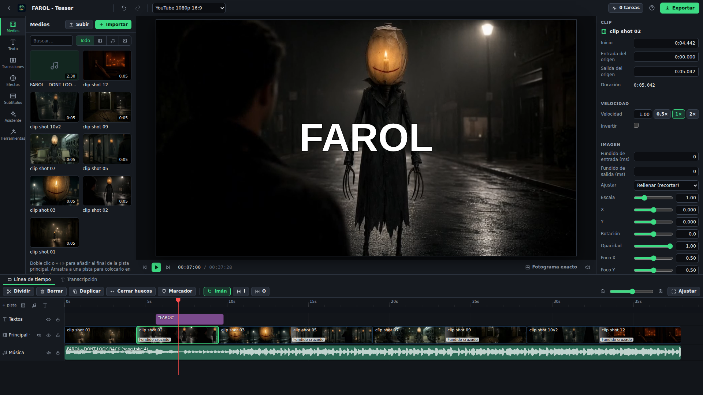

<p align="center"></p>

# Lumiere's Hoard

Un editor de vídeo local que funciona en el navegador y en tu propio ordenador. Tiene timeline multipista, edita por texto sobre transcripciones con tiempos por palabra, hace solo el trabajo repetitivo (silencios, muletillas, reencuadre vertical, subtítulos, cortes al ritmo, montajes desde un guion) y convierte peticiones en lenguaje natural en planes de edición que revisas antes de que cambie nada. Los renders son codificaciones de ffmpeg exactas al fotograma que usan el codificador de NVIDIA cuando lo hay. Todo está también disponible para asistentes por MCP, así que a un agente se le puede decir «toma este vídeo, quita los silencios, hazlo vertical y ponle subtítulos».

[English](README.md)



## Qué hace

Comprobado el 9 de octubre de 2026: la vista previa sencilla sigue las claves de
brillo y saturación con WebGL desactivado. Dividir conserva las claves y sus
dominios de ease; editar un segmento mantiene los dominios no afectados. Pasan
MCP nativo, edición/recarga/deshacer en navegador, comprobaciones frontend,
suite Python y build. El cambio está activo en la app gestionada. Queda una
diferencia de muestreo de la curva renderizada antes y después de dividir,
registrada como Ágora124; aún no se certifica su igualdad renderizada.

**Biblioteca y timeline**
- Abre originales compartidos de Atlas mediante `media_shared(file_id)`, sin copiarlos. Repite la operación tras editar el original en Paint, Gimp u otro Hoard: conserva el ID del medio en los montajes y renueva sus cachés. Respeta las carpetas autorizadas y espera a que terminen los trabajos activos de ese medio; no hay vigilancia continua.
- Importa archivos o carpetas enteras por ruta (no copia nada) y sube archivos arrastrándolos. Cada medio recibe en segundo plano un proxy de 540p con GOP corto para moverse con fluidez, una tira de miniaturas y la forma de onda.
- Pistas de vídeo, audio y texto; la primera de vídeo es la principal y las demás se dibujan encima (imagen en imagen, superposiciones).
- Dividir, recortar con o sin arrastre, mover, deslizar el contenido sin mover el clip, mover un corte entre dos clips, borrar cerrando el hueco, cerrar huecos, duplicar, copiar y pegar, imán al cabezal, a los bordes y a los marcadores, rango de entrada y salida, marcadores y capítulos.
- Por clip: velocidad (el audio conserva el tono) y curvas de velocidad (entrada y salida suaves, acelerar, cámara lenta en un golpe o tus propios puntos; el sonido sigue la curva), inversa, volumen, fundidos de imagen y de sonido, encaje (contener, cubrir, llenar, tamaño nativo o el cuadro entero sobre un fondo desenfocado), posición, escala, rotación, opacidad, recorte, keyframes de posición, escala, rotación, opacidad, volumen, brillo y saturación (los del efecto de color) con suavizado, máscaras de forma (rectángulo, redondeada, elipse; borde suave, invertir, animadas con keyframes), efectos (color, LUT, desenfoque, nitidez, reducción de ruido, croma, viñeta, estilos; ruido de audio, mejora de voz, filtros, compresor, tono, eco) y 20 transiciones.
- Rótulos con estilos y animaciones (fundido, pop, subida, máquina de escribir). Imagen congelada. Estabilización (vid.stab en dos pasadas sobre el tramo que usa el clip). Música que baja cuando se habla.
- Secuencias anidadas: otro proyecto usado como un clip, anidar una selección en su propio proyecto y desanidarla; los bucles se rechazan y el render anidado se guarda hasta que cambia.
- Multicámara: grabaciones del mismo momento sincronizadas por el sonido (desfase y confianza por cámara, corrección a mano), un sonido maestro continuo, cortar a un ángulo en el cabezal pulsando su miniatura, o cortar solo a quien habla (plano mínimo, histéresis).
- Plantillas: guardar un proyecto como plantilla con huecos con nombre (intro, principal, cierre…) y crear proyectos nuevos rellenándolos con otros medios; se conservan rótulos, estilo de subtítulos, música y efectos.
- Deshacer y rehacer cada cambio, y un historial al que se puede volver.

**Edición por texto**
- Transcripción local con tiempos por palabra (faster-whisper; large-v3-turbo en GPU, un modelo más pequeño en CPU). Doce minutos de habla tardan medio minuto en una GPU.
- Las palabras que se oyen en el timeline se ven como texto: seleccionarlas y borrarlas las corta del vídeo, o se puede conservar solo una selección. Las correcciones del texto pasan a los subtítulos.
- Separación de hablantes en el propio ordenador (motor propio por tono y forma del espectro, o huellas de voz si están instaladas): renombrar hablantes, corregir quién dijo qué, quedarse con lo que dice uno o quitarlo, subtítulos con el color o el nombre de cada hablante.
- Quita muletillas («eh», «o sea», «um», «like»…) y palabras repetidas; quita o acelera los silencios con un umbral sacado del ruido de fondo.
- Montaje desde guion: la grabación de alguien leyendo un guion (o un teleprompter), con repeticiones, queda como una toma por sección en el orden del guion, con un marcador de capítulo por sección. Si la charla sigue el guion con libertad, el modelo local encuentra qué frases cuentan cada sección.

**Herramientas automáticas**
- Reencuadre a 9:16, 1:1 o 4:5 con una cámara que sigue al sujeto (caras con el detector YuNet de OpenCV, que se descarga una vez, o los detectores clásicos; si no movimiento y detalle; fija dentro de una escena cuando el sujeto no se mueve, suave y con velocidad limitada cuando se mueve), o el cuadro entero sobre un fondo desenfocado.
- Subtítulos quemados en el render en seis estilos (limpio, negrita, karaoke, pop palabra a palabra, con caja, mínimo) y exportación SRT / VTT / ASS.
- Detección de escenas por cambio de color, con cortes o marcadores en cada escena.
- Corte de un grupo de clips o de las escenas de un vídeo al ritmo de una canción (tempo y pulsos calculados en la app).
- Momentos destacados de un vídeo largo (momentos fuertes, picos, movimiento, cortes, exclamaciones de la transcripción) y cortos verticales a partir de ellos con un clic; opcionalmente el modelo local lee la transcripción buscando ganchos, remates e ideas completas.
- Música de fondo: ordena las pistas de una carpeta según encajen su tempo, duración y energía con el montaje, y pone la elegida debajo recortada, con fundidos y bajando cuando se habla.
- Sugerencias de recursos (b-roll): clips de la biblioteca cuyas palabras, nombre o etiquetas casan con lo que se dice en cada frase, colocados en silencio sobre ese tramo con un clic.
- Igualar el volumen entre clips; exportaciones normalizadas a -14 LUFS (u otro objetivo) en dos pasadas.

**Planes de edición en lenguaje natural**
- Escribe «recorta los primeros 5 segundos, quita los silencios, subtítulos estilo karaoke y hazlo vertical» y recibes una lista de pasos (operaciones del timeline, herramientas, exportaciones) con una frase cada uno; puedes desactivar pasos, editarlos y aplicarlos como un solo paso de deshacer.
- Escribe el plan el modelo local cuando lo hay (a través del backend de modelos compartido de la familia); sin él, un lector por reglas entiende las peticiones habituales en español e inglés.

**Exportación**
- MP4 H.264 o H.265, MOV ProRes 422 HQ, una versión ligera de 720p, una vista previa rápida de 540p desde los proxies, GIF, MP3 y WAV; un tramo del timeline o todo; un .srt junto al vídeo; varios lienzos a la vez (16:9, 9:16, 1:1, 4:5) en una sola tarea, cada uno reencuadrado sobre una copia del proyecto; subtítulos traducidos por el modelo local con los tiempos originales (SRT / VTT / ASS, quemados, u original y traducción en dos líneas); un EDL CMX 3600 de la pista principal; corte sin pérdida (copia de flujo, cortes en fotogramas clave) para grabaciones largas que solo hay que recortar.
- El timeline se parte en trozos que se codifican en paralelo (cada trozo abre solo los clips que muestra, así que cientos de cortes nunca son cientos de decodificadores) y se unen sin recodificar; el sonido se mezcla en una pasada. Cada exportación se comprueba: duración, tamaño, que haya sonido, sonoridad, saturación.
- Una sola regla de tiempo para cada fotograma (el último fotograma de origen alcanzado antes de medio fotograma de salida después), comprobada fotograma a fotograma en las uniones de trozos, cambios de cadencia y de velocidad; el fotograma que muestra el timeline en cualquier instante se puede renderizar tal cual lo dibuja la exportación.
- La vista previa en directo se dibuja con WebGL2 desde los proxies con las mismas cuentas que el render (encajes, fondo desenfocado, keyframes, máscaras, curvas de velocidad, las 20 transiciones, efectos de color y LUT), medida contra el render por debajo del 4 % de diferencia media (vista previa CSS si no hay WebGL2).

## Cómo se arranca

Necesita Python 3.11+, Node 22 (para compilar la interfaz) y ffmpeg 6 o posterior en el PATH (`winget install Gyan.FFmpeg` en Windows).

```bash
python -m venv venv
venv\Scripts\python -m pip install -r requirements.txt      # Windows (venv/bin/python en otros sistemas)
venv\Scripts\python -m pip install -r requirements-gpu.txt  # opcional: transcribir en una GPU NVIDIA sin el toolkit de CUDA
venv\Scripts\python -m pip install -r requirements-speakers.txt  # opcional: huellas de voz para voces parecidas
npm ci && npx vite build
venv\Scripts\python -m lumiere_hoard                         # http://127.0.0.1:5198
```

`python scripts/launch.py` la arranca y abre el navegador; `python scripts/dev.py` levanta la API con recarga y el servidor de desarrollo de Vite.

Ajustes (entorno): `LUMIERE_PORT` (5198), `LUMIERE_DATA_DIR`, `LUMIERE_FILE_ROOTS` (carpetas que puede leer y donde puede exportar, separadas por `;` en Windows), `LUMIERE_ENCODER` (`auto`, `nvenc`, `x264`), `LUMIERE_RENDER_WORKERS` (trozos a la vez, 3), `LUMIERE_WORKERS` (tareas de fondo a la vez, 2), `LUMIERE_FFMPEG` / `LUMIERE_FFPROBE`. En la app: modelo, dispositivo e idioma de la transcripción, decodificación por GPU, carpeta de exportación, transcripción automática de lo que se importa, el modelo para los planes y quién avisa de las exportaciones terminadas (`notify.via`: `auto`, `hub`, `off`).

## Asistentes (MCP)

`project_contact_sheet` exporta fotogramas nativos con tiempos, hojas JPEG/PNG,
HTML portátil y recibo JSON de procedencia. El menú **Hoja** del editor ofrece
Resumen, Cortes y Adaptativo. El enum `mode` de la API y MCP es
`overview | boundaries | adaptive`: Resumen distribuye las muestras por el
timeline, Cortes toma muestras antes y al comienzo de clips de la pista
principal, y Adaptativo prioriza cambios visuales en un análisis acotado y
conserva los extremos del montaje. También admite tiempos explícitos en
milisegundos. Rechaza cambios de fuente o timeline durante la captura.
[API, muestreo y límites verificados](docs/CONTACT-SHEETS.es.md).

`mcp_server.py` es un puente MCP por stdio con 56 herramientas. Nunca abre la base de datos: cada llamada va a la app en marcha con el token de `data/mcp-token`, y arranca la app si no responde nadie.

```json
{"command": "<repo>/venv/Scripts/python.exe", "args": ["<repo>/mcp_server.py"],
 "env": {"LUMIERE_URL": "http://127.0.0.1:5198", "LUMIERE_TOKEN_FILE": "<repo>/data/mcp-token"}}
```

Las herramientas cubren la biblioteca (`media_import`, `media_analyze`, `transcript_get`, `speakers_edit`, `highlights_find`, `music_pick`, `broll_suggest`…), la multicámara (`multicam_sync`, `multicam_create`, `multicam_switch`, `multicam_auto`), las plantillas (`template_save`, `template_list`), los proyectos y el timeline (`project_create`, `project_get`, `timeline_edit` con 40 operaciones, `timeline_nest`, `timeline_history`), la edición inteligente (`edit_command`, `text_cut`, `timeline_transcript`), los planes (`plan_create`, `plan_apply`), la salida (`render_start`, `job_status`, `renders_list`, `frame_snapshot`, `project_contact_sheet`, `subtitles_export`, `subtitles_translate`) y los ajustes. Si una operación o un campo no existe, la respuesta lista todas las operaciones con sus campos; `project_get` pone primero los rótulos y lee los timelines largos por pista o por tramo; `frame_snapshot` devuelve la imagen (una imagen MCP) y las capas que se dibujan en ese instante (rótulos, subtítulos, medios), para que un asistente compruebe su propio trabajo. Las apps hermanas pueden mandar medios (`media_receive`, o el evento `lumiere.media.import` en `/api/family/events`), traer un montaje entero (`project_from_timeline`, más abajo) y enterarse de cuándo acaban los renders y las transcripciones (`GET /api/family/contract` lista los eventos). `faustus-plugin.json` describe la app, cómo se arranca y el puente para los anfitriones que lo leen.

`project_contact_sheet(project, mode="overview"|"boundaries", count=12, width=320, times?)` devuelve una imagen con hasta 16 fotogramas y sus tiempos. El modo general reparte las muestras; el de cortes muestra ambos lados de los comienzos de clips de la pista principal. Se puede indicar una lista de tiempos en milisegundos. Usa el mismo renderizador que el montaje final y rechaza una revisión si el proyecto cambia mientras la genera. La imagen ayuda a revisar ritmo y cortes; no comprueba por sí sola la continuidad del movimiento.

### Sesiones de agente, motivos y deshacer

Cada cambio que un asistente hace por el puente MCP (o con `POST /api/agent/call`) deja rastro. La interfaz web no es un agente y queda
fuera de todo esto. Referencia completa: [agentes con responsabilidad](docs/ACCOUNTABLE_AGENTS.es.md).

- **Quién.** El puente envía el agente y la sesión que lee de `HOARD_AGENT_ID` / `HOARD_AGENT_SESSION` (cabeceras `X-Agent-Id` / `X-Agent-Session`).
  Un token con ámbito fija el nombre del agente digan lo que digan las cabeceras.
- **Por qué.** Toda herramienta que no sea de solo lectura necesita un `reason` de 3 a 300 caracteres (si falta, `400 reason_required` con una
  pista). Las de lectura no lo necesitan.
- **Qué.** Cada cambio es una línea de `data/agent_journal.jsonl` (herramienta, agente, sesión, motivo, resumen enmascarado de los argumentos,
  objetos tocados, hora, éxito o error), que se lee con `GET /api/agent/journal?session=&agent=&limit=`.
- **Deshacer una sesión entera.** `POST /api/agent/undo {"session": "...", "dry_run": true}` dice qué se desharía; con
  `{"confirm": true, "reason": "..."}` lo hace, del cambio más reciente al más antiguo. Un proyecto vuelve al montaje que tenía antes de la sesión,
  guardado como un paso nuevo del historial (el Deshacer y el Rehacer del editor siguen funcionando); vuelven proyectos, entradas de la
  biblioteca, etiquetas, transcripciones, hablantes, líneas traducidas, planes y ajustes que la sesión creó o cambió. Informa de lo que no pudo
  deshacer (`media_delete`, `project_delete`, renders, exportaciones, `media_analyze`, `clip_stabilize`, las herramientas creativas, resultados de
  trabajos en segundo plano) y no toca nunca otra sesión: si otra sesión, o la persona en el editor, cambió después el mismo proyecto, ese cambio
  se declara conflicto y se deja como está.
- **Perfiles.** `python -m lumiere_hoard.hoard_link.tokens mint --app-data-dir data --agent drafter --profile drafts` muestra un token (una sola vez;
  `data/agent_tokens.json` solo guarda hashes). Perfiles: `read_only`, `drafts` (además, las herramientas que crean o editan borradores sin borrar,
  exportar ni publicar: sin `render_start`, `project_delete`, `media_delete`, `settings`, `plan_apply` ni exportaciones) y `all`. Una llamada
  bloqueada responde `403 profile_forbidden`.

## Familia

- **Traer un montaje de otra app.** `project_from_timeline {title, fcpxml_path | edl_path | plan, fps?, media_dirs?}` crea un proyecto desde un XML FCP7 (`xmeml`) o un EDL CMX 3600 tal como los exporta el estudio de vídeo (clips de imagen con sus recortes, una canción en su pista, las líneas cantadas como marcadores), o desde un plan `{clips: [{path, in_s, out_s, track, start_s?}], markers: [{t, text}]}`. Todo entra como un solo paso de deshacer; los medios se leen donde están (dentro de las carpetas permitidas), el lienzo sale del XML (un EDL no lo trae: la forma de la primera imagen, `fps` o 24) y un clip cuyo archivo no aparece se salta y se lista en `skipped` mientras llega el resto. Responde `{ok, project_id, url, clips, markers, skipped, duration_ms}`.
- **Renders como eventos de tarea.** Un render, un render de varios formatos o un corte sin pérdida envía `lumiere.job.queued`, `.started`, `.progress` (como mucho uno cada 5 s, con `eta_s`) y `.cancelled`, y al final `lumiere.render.done` / `lumiere.render.failed`, que el hub lee como `lumiere.job.done` / `.failed` con `kind: render`. Cada evento lleva `job_id`, `title` (el nombre del proyecto), `kind`, `progress` y `url`; una salida terminada lleva además `ref` = `hoard://lumiere/render/<id>`, que la regla del hub entrega a la app de publicación para empezar un borrador. El fallo de un render se envía una sola vez; `lumiere.job.failed` queda para las tareas que no son renders.
- **Avisos por el hub.** Cuando una exportación termina o falla se le pide al hub que te avise (prioridad normal, alta si falla, con enlace al proyecto). Lumiere no tiene canal propio: `notify.via` = `auto` (cuando el hub responde), `hub` (pedirlo siempre) u `off` (no avisa nadie). Un render cancelado no avisa.

## Cómo está hecha

- `lumiere_hoard/timeline.py`: el documento del proyecto (lienzo, pistas, clips, marcadores, subtítulos; milisegundos enteros).
- `lumiere_hoard/ops.py`: el vocabulario de operaciones, que se aplican todas o ninguna sobre una copia del proyecto; lo comparten la interfaz, las herramientas MCP y los planes.
- `lumiere_hoard/render/`: el compilador (timeline → scripts de filtros por trozo, transiciones con `xfade`, rótulos y subtítulos en un solo archivo ASS, el grafo de sonido desde másteres FLAC), el ejecutor (trozos en paralelo, sonoridad, mezcla final, control de calidad, fotogramas, corte sin pérdida) y la tabla de efectos (lo que no está en ella se rechaza).
- `lumiere_hoard/analysis/`: sonido (envolvente, silencios, sonoridad, tempo y pulsos), imagen (escenas, movimiento, el seguimiento del foco y los caminos de cámara), voz (transcripción, muletillas) y alineación con un guion.
- `lumiere_hoard/commands.py`, `plan.py`: edición inteligente y planes; `jobs.py`: la cola de tareas de fondo (proxies, análisis, transcripción, renders) con progreso y cancelación.
- `lumiere_hoard/timeline_import.py` (lectores de XML FCP7, EDL y plan, y el constructor de proyectos), `lumiere_hoard/jobevents.py` (eventos de tarea de los renders y avisos por el hub).
- `lumiere_hoard/speakers.py`, `multicam.py`, `music.py`, `broll.py`, `subtitles.py`, `family_events.py`: separación de hablantes, grupos multicámara, el selector de música, las sugerencias de recursos, la traducción de subtítulos y los eventos de familia; `render/sequences.py` (renders anidados en caché) y `render/formats.py` (varios lienzos por tarea).
- `client/`: interfaz en React: biblioteca, vista previa dibujada con WebGL2 a partir de los proxies (`client/src/editor/gl/`), timeline, inspector, vista de texto, asistente y exportación.

Pruebas: `python -m pytest -q` (medios sintéticos hechos con ffmpeg; los renders se comprueban fotograma a fotograma). `python scripts/preview_check.py` (necesita Playwright) mide la vista previa en directo contra el render caso por caso.

## Límites

- La vista previa en directo se parece mucho al render pero no es idéntica (la transición «disolver» es la que más se aleja); «Fotograma exacto» y la exportación de vista previa a 540p muestran el resultado real. La reducción de ruido no se dibuja en la vista previa.
- El montaje desde guion por sentido, los destacados con el modelo y la traducción de subtítulos dependen del modelo local. El motor propio de hablantes está ajustado para voces claramente distintas; con voces parecidas hacen falta las huellas de voz (requirements-speakers.txt) o el número de hablantes.
- El seguimiento de caras necesita descargar una vez el modelo YuNet (230 KB); sin red usa los detectores clásicos, peores de perfil o con caras pequeñas.

## Licencia

MIT.

## Intercambio OpenTimelineIO

`project_export_otio` guarda un archivo `.otio` real; también puedes descargarlo
con `GET /api/projects/{id}/otio`. Se importa con
`project_from_timeline(otio_path=...)`. El serializador oficial conserva todas las
pistas, clips, huecos, fundidos, referencias a medios y marcadores del proyecto.
Rótulos, apariencia, audio, animaciones, curvas de velocidad y ajustes viajan en
metadatos de Lumiere versionados: al reimportar archivos sin modificaciones se
recuperan sus valores editables. Los cambios externos de tiempos o efectos
tienen prioridad sobre los metadatos anteriores del clip.

Cada operación informa de valores conservados solo como metadatos, aproximados,
no compatibles u omitidos. Se importan las dimensiones y la frecuencia de audio
de los metadatos de FilmCraft; los efectos y encuadres externos sin equivalencia
se indican como no conservados.
La posición, escala uniforme y rotación estáticas de FilmCraft se convierten
en una transformación editable con ancla centrada y píxeles cuadrados. Los
encuadres animados/no uniformes, colores y demás efectos siguen pendientes.
OTIO genérico sin dimensiones usa un lienzo
1920×1080 e informa de esa aproximación. Las pistas de vídeo OTIO externas son
silenciosas: el sonido procede de sus pistas de audio. La exportación crea pistas
de sonido independientes para los vídeos, incluidas las pistas de imagen ocultas.
Los másteres FLAC enlazados, sin pérdidas, a 48 kHz y estéreo conservan el canal
seleccionado y la mezcla del editor; `audio_sources` enumera sus archivos.
Consérvalos con los vídeos al mover un montaje. Se convierten las ganancias de
clip y pista de FilmCraft; fundidos, ducking y automatización siguen en metadatos.
Los originales no se modifican.

Una reimportación sin cambios recupera las pistas e identificadores nativos sin
duplicar sonido. Mover, silenciar, borrar o cambiar el audio derivado conserva
las pistas externas reales y silencia el sonido de la imagen correspondiente.
Si la imagen no está disponible, se conserva el máster de audio existente.
La ganancia modificada en FilmCraft tiene prioridad sobre la exportada; una
ganancia externa intacta no sobrescribe un cambio intencionado en los metadatos
de sonido de Lumiere.

**Importar montaje** en Proyectos admite OTIO, FCP7 XML y CMX EDL. El diálogo de
exportación descarga **Montaje editable (.otio)**. La misma importación se
expone en `POST /api/projects/import-timeline` con
`{path, format?: "auto" | "otio" | "fcpxml" | "edl", title?, media_dirs?, fps?}`.
Los medios ausentes dejan huecos. Los tiempos
fraccionarios externos se redondean al reloj nativo de milisegundos, indicando
el error máximo. Otros editores pueden no dibujar los rótulos o efectos de
Lumiere. Las composiciones anidadas/recortadas y los clips externos invertidos
aún no son compatibles; se rechazan antes de crear un proyecto. Esto no implica
paridad completa de intercambio con otros editores.

## Ediciones duraderas del montaje por MCP

Proyectos también incluye el taller EffectCraft/FilmCraft: composiciones de
rótulos editables con keyframes de opacidad y vistas previas, además de secuencias
FilmCraft y exportaciones H264 reales a partir de copias de medios. El catálogo
y despacho por lotes están disponibles por MCP. Consulta
[motores creativos](docs/CREATIVE_ENGINES.es.md) para configurar los motores y
conocer la semántica exacta de cada lote.

Pasa `request_id` opcional a `timeline_edit` o `POST /api/projects/{id}/edit`.
Repite la misma clave con `ops`, `label` y `base_rev` idénticos tras una respuesta
interrumpida para recuperar los IDs y el resultado originales sin aplicar dos veces
el cambio. El recibo persiste tras reinicios y se guarda atómicamente con el proyecto
y el historial. Un cambio diferente necesita otra clave; reutilizarla con contenido
distinto devuelve un conflicto. `rev` es la revisión del resultado original y
`current_rev` informa de la revisión actual. Reintentar tras Deshacer devuelve el
recibo sin rehacer la edición. Sin clave se conserva la aplicación normal de cada cambio.
